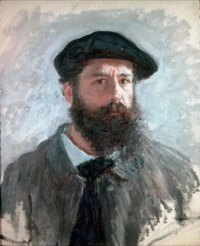
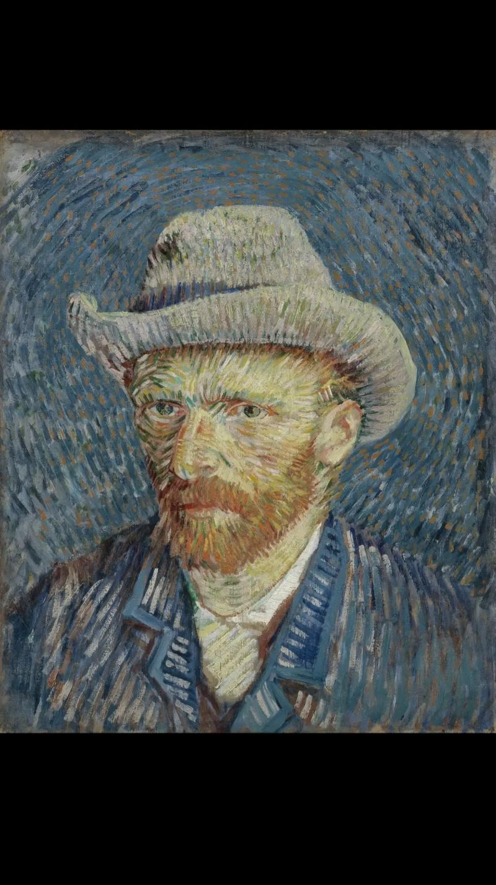
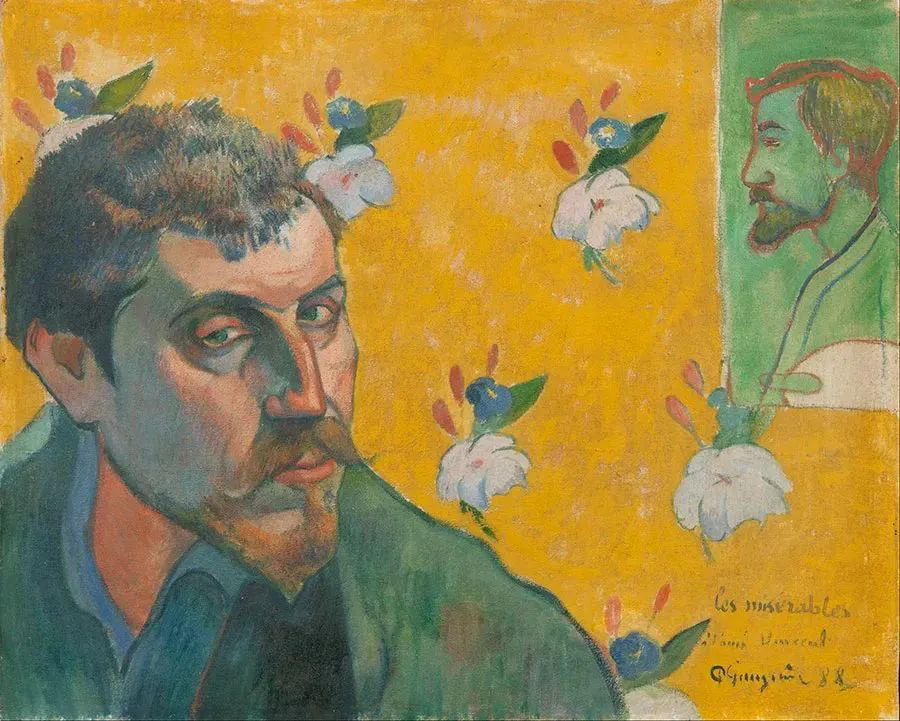
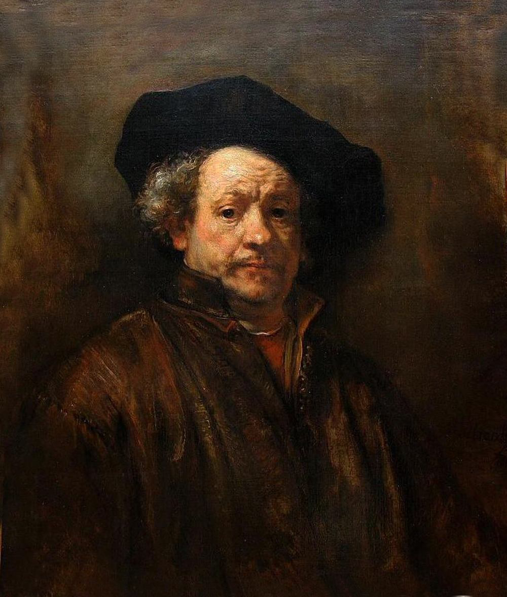
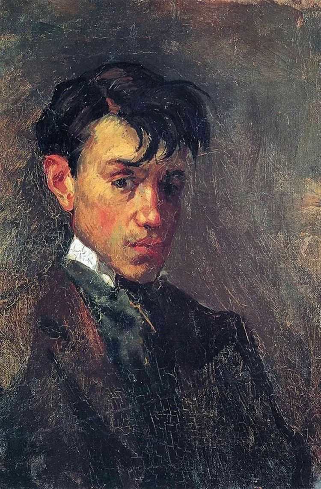
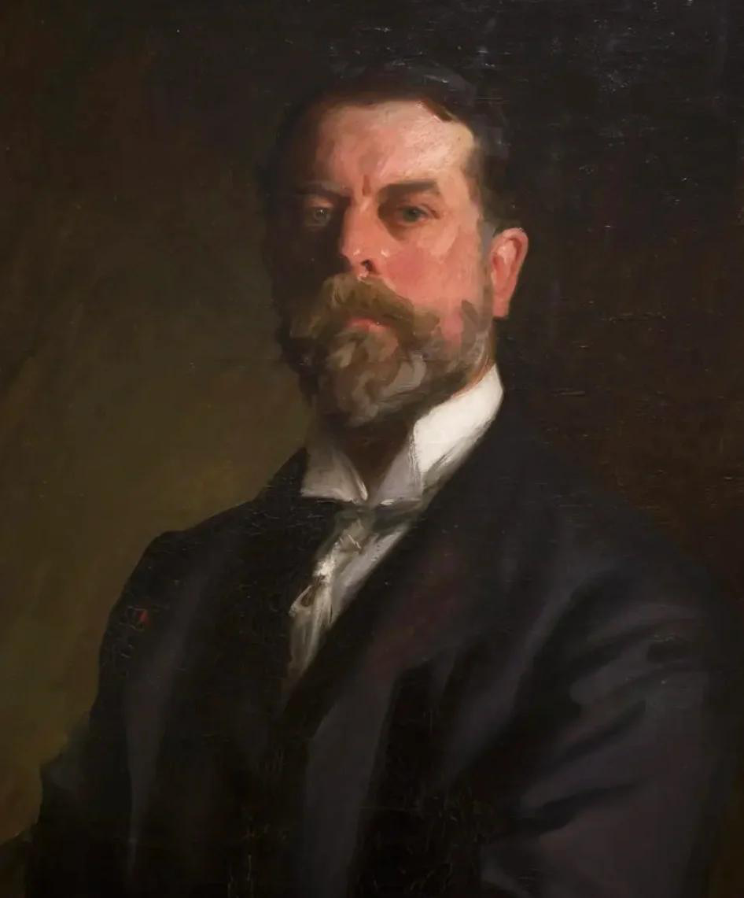

<p align="center">
  
</p>

<h1 align="center">星绘智愈 Star BindPaint</h1>

<p align="center">
  <strong>AI 辅助油画教育与艺术疗愈系统 — 从学到创，在艺术中感受疗愈</strong>
</p>

<p align="center">
  2026 Light 创造营 · 星月绘愈社 · 上海交通大学
</p>

<p align="center">
  <a href="https://star-bindpaint.vercel.app">🌐 在线体验</a> ·
  <a href="https://star-bindpaint.vercel.app/onboard">🎨 开始创作</a> ·
  <a href="#-两步递进体验">✨ 两步体验</a> ·
  <a href="#-五步疗愈流程">💫 疗愈流程</a> ·
  <a href="./PROJECT_OVERVIEW.md">📄 项目总览</a> ·
  <a href="./RECORDING_SCRIPT.md">🎬 录屏脚本</a>
</p>

---

> *"我想在最短暂的瞬间里，捕捉最绚烂的色彩。"* — 莫奈

---

## 🌟 项目简介

星绘智愈是一个面向孤独症儿童的 AI 辅助油画教育与艺术疗愈系统，通过"**从学到创**"的递进式体验帮助儿童建立创作自信：

<table>
<tr>
<td width="50%">

### 🖌️ 第一步 · 临摹学习

AI 将大师经典画作拆解为笔触序列，你画 1 笔系统自动补 100 笔，跟着引导线轻松完成一幅油画

> *"画画不需要画得'像'，只要把你看到的光和色彩留下来就够了。"* — 莫奈

</td>
<td width="50%">

### ✨ 第二步 · 自由创作

画任何你想画的内容，每一笔实时变成大师的油画风格，还能一键"变成油画"让 AI 渲染为完整油画

> *"我梦想着绘画，然后我画下了我的梦。"* — 梵高

</td>
</tr>
</table>

系统同步采集绘画过程数据（情绪变化、色彩偏好、笔触节奏、专注区域），由腾讯混元 / 阿里百炼大模型生成**有数据支撑的陪伴笔记**——
不是临床诊断，而是让监护人在每一次画画后多一份具体的看见。

---

## ✨ 两步递进体验

| | 模式 | 描述 | 适合场景 |
|:---:|------|------|---------|
| 1️⃣ | **临摹学习** | 选择大师画作 → 你画1笔AI补100笔 → 跟着引导线完成 | 建立信心 |
| 2️⃣ | **自由创作** | 自由画 + 6种大师风格实时转换 + 主题引导 + 一键变成油画 | 自由表达 |

**附加能力**（贯穿两步）：

| 功能 | 描述 |
|:---:|------|
| 👀 共同注意 | 每画几笔 AI 暂停提问："这是什么颜色？在哪里？" |
| 📝 主题引导 | 5个低门槛主题（☀️天气 / 🎨心情 / 🏠安全地点 / 〰️慢线条 / 🪐小星球） |
| ✨ 变成油画 | 一键将简笔画渲染为完整大师级油画 |

---

## 💫 五步疗愈流程

```
😊 选心情 → 🎨 选大师/自由创作 → ✏️ 陪画/自由画 → 😌 再选心情 → 📋 疗愈报告
```

| 步骤 | 内容 | 大师说 |
|:---:|------|------|
| 😊 | **情绪前测** — 选择今天的心情，系统自动适配难度 | *"每个孩子都是艺术家。"* — 毕加索 |
| 🎨 | **选择体验** — 临摹30幅经典或自由创作选风格 | *"我闭上眼睛，为的是能看见。"* — 高更 |
| ✏️ | **创作过程** — 跟着引导线或随意画 + 实时风格化 | *"试着在你的画中注入灵魂。"* — 伦勃朗 |
| 😌 | **情绪后测** — 画完后再选心情，量化情绪变化 | *"画一幅画就像做一次实验。"* — 萨金特 |
| 📋 | **疗愈报告** — LLM 生成温暖的观察记录 | *"你的笔触温柔地改变了心情。"* — Starry |

---

## 🎨 大师作品库 & 风格

<table>
<tr>
<td align="center" width="16%"><br /><strong>莫奈</strong><br /><sub>印象派</sub></td>
<td align="center" width="16%"><br /><strong>梵高</strong><br /><sub>后印象派</sub></td>
<td align="center" width="16%"><br /><strong>高更</strong><br /><sub>后印象派</sub></td>
<td align="center" width="16%"><br /><strong>伦勃朗</strong><br /><sub>巴洛克</sub></td>
<td align="center" width="16%"><br /><strong>毕加索</strong><br /><sub>立体主义</sub></td>
<td align="center" width="16%"><br /><strong>萨金特</strong><br /><sub>水彩</sub></td>
</tr>
<tr>
<td align="center"><sub>柔和渐细<br/>光影跳跃</sub></td>
<td align="center"><sub>旋转厚涂<br/>大胆饱和</sub></td>
<td align="center"><sub>大色块平涂<br/>原始力量</sub></td>
<td align="center"><sub>明暗对比<br/>干笔飞白</sub></td>
<td align="center"><sub>几何断笔<br/>大胆变色</sub></td>
<td align="center"><sub>流畅渐细<br/>轻盈透明</sub></td>
</tr>
</table>

> *"我喜欢画星星、向日葵和麦田。有时候我觉得颜色会说话——黄色是快乐，蓝色是思念。"* — 梵高

---

## 🧩 ASD 适配功能（11 项）

> *"让每个孩子都能用画笔将内心的孤岛连接成星海——艺术不是特权，而是每颗星星与世界沟通的语言。"*

| # | 功能 | 原理 / 实现 |
|:---:|:---:|------|
| 1 | 🌙 **安静模式** | 低刺激界面：去动画、柔和色、大字号（感觉统合理论） |
| 2 | 📊 **分层难度** | 1/2/3 档 → roughness + maxStrokes 自动适配（最近发展区 ZPD） |
| 3 | 📋 **视觉时间表** | TEACCH 垂直步骤条，实时进度显示 |
| 4 | 👁️ **先看后做** | 每笔先演示一遍再让孩子画（Visual Modeling） |
| 5 | 💨 **情绪被动检测** | 6 类信号融合 + 5 分钟冷却 → 自动触发平静呼吸（4-7-8 呼吸法） |
| 6 | 📖 **社交故事** | 首次使用前 6 页图文引导（Carol Gray 1991 标准） |
| 7 | 👤 **照护者提示** | 给旁边家长/治疗师的动态指导语（Co-regulation） |
| 8 | 😊 **情绪前后测** | 量化每次绘画的情绪变化（4 选 1 表情） |
| 9 | 📝 **主题引导** | 5 种低门槛分步引导（天气/心情/安全地方/慢线条/小星球） |
| 10 | 👀 **共同注意问答** | 暂停问颜色/位置/情感联想（ABA 离散试验） |
| 11 | 🎯 **童趣按钮** | 所有操作图标化 + Neo-Brutalist 视觉，降低文字阅读门槛 |

---

## ⚙️ 技术栈

| 层 | 技术 | 版本 / 用途 |
|:---:|------|------|
| 🖥️ | **Next.js** | 16.2.6 · App Router + Turbopack + API Routes |
| ⚛️ | **React** | 19.2.4 |
| 📘 | **TypeScript** | ^5 · 严格模式 |
| 🎨 | **Tailwind CSS** | v4 · 色彩系统 + 安静模式变量 |
| ✨ | **Framer Motion** | ^12.38 · 动画（安静模式自动禁用） |
| 🪐 | **three.js** | ^0.167 · 首页 Ballpit 3D 彩球氛围 |
| 🖌️ | **Canvas 2D** | 三层画布架构 · 引导线 / 用户笔迹 / 风格化结果 |
| 🧠 | **笔触分解引擎** | Hertzmann 1998 多层误差驱动 + Sobel 梯度追踪 + 边界感知 |
| 🎭 | **实时风格化引擎** | 6 种大师风格 · 纯前端零依赖运行 |
| 🎨 | **腾讯混元生图 hy-image-v3.0** | "变成油画" AI 深度渲染（异步轮询 ≤ 60s） |
| 📋 | **腾讯混元 / 阿里百炼 LLM** | 多模态观察报告（hunyuan-vision → qwen-vl-plus 降级链） |
| ☁️ | **阿里云 OSS** | 画廊图片云端存储（HMAC-SHA1 签名 REST API） |
| 🔄 | **三层降级链** | LLM 主备 · 图片 OSS→base64 · 离线 localStorage 50 幅 LRU |

---

## 🚀 快速开始

```bash
npm install
npm run dev    # → http://localhost:3001（3000 常被占用，dev server 自动回退）
```

**线上访问**：https://star-bindpaint.vercel.app

> 💡 完整 LLM 体验需在 `.env.local` 配置 `HUNYUAN_API_KEY` 与 `DASHSCOPE_API_KEY`。
> 未配置时画板与画廊功能正常，仅"变成油画"和"观察报告"会降级提示。

---

## 📚 项目文档

| 文档 | 用途 |
|------|------|
| [README.md](./README.md) | 项目总入口（你正在看的） |
| [PROJECT_OVERVIEW.md](./PROJECT_OVERVIEW.md) | 📄 完整项目介绍 · 16 节 542 行 · 含算法详解、API 数据流、ASD 适配 11 项 |
| [RECORDING_SCRIPT.md](./RECORDING_SCRIPT.md) | 🎬 录屏讲解脚本 · 10 个 SCENE · 7 分钟分镜 + 旁白 + 字幕 |
| [ASD_IMPROVEMENT_PLAN.md](./ASD_IMPROVEMENT_PLAN.md) | 🧩 孤独症儿童适配规划 |
| [CLAUDE.md](./CLAUDE.md) | 🤖 项目级 AI 协作上下文 |

---

## 📁 页面路由

| 路径 | 功能 |
|------|------|
| `/` | 🏠 产品封面展示页 |
| `/onboard` | 😊 情绪前测 + 能量选择 |
| `/create` | 🎨 大师作品库 / 自由创作 / 上传图片 |
| `/paint` | ✏️ 核心画布（临摹 / 自由 + 风格化 + 变成油画） |
| `/report` | 📋 AI 疗愈观察报告 |
| `/gallery` | 🖼️ 我的画廊 |
| `/settings` | ⚙️ 家长/治疗师设置 |
| `/intro` | 📖 产品介绍 |

---

## 🏗️ 项目结构

```
src/
├── app/
│   ├── page.tsx              # 封面首页
│   ├── onboard/page.tsx      # 情绪前测 + 能量 + 社交故事
│   ├── create/page.tsx       # 大师作品库 / 自由创作 / 上传图片
│   ├── paint/page.tsx        # 核心画布（临摹+自由+风格化+变成油画）
│   ├── report/page.tsx       # AI 疗愈报告（情绪变化+LLM观察）
│   ├── gallery/page.tsx      # 画廊（OSS 云端存储）
│   ├── settings/page.tsx     # 家长设置
│   ├── intro/page.tsx        # 产品介绍
│   └── api/
│       ├── analyze/route.ts  # 通义千问 VL 疗愈分析
│       ├── sd-render/route.ts # "变成油画" DashScope 渲染
│       └── upload/route.ts   # OSS 图片上传
├── contexts/
│   └── AppContext.tsx         # 全局设置（安静模式/难度/先看后做）
├── components/
│   ├── PaintCanvas.tsx        # 三层 Canvas 画布 + 风格化集成
│   ├── MasterBubble.tsx       # 大师对话气泡（打字机效果）
│   ├── MasterQuoteCard.tsx    # 随机大师名言卡片
│   ├── EmotionPicker.tsx      # 情绪前后测选择器
│   ├── SocialStory.tsx        # 社交故事引导（6页）
│   ├── VisualSchedule.tsx     # 视觉时间表
│   ├── WatchDemo.tsx          # 先看后做演示动画
│   ├── CalmBreathing.tsx      # 呼吸引导（4s膨胀6s收缩）
│   ├── SharedAttention.tsx    # 共同注意问答
│   ├── FreeModeThemes.tsx     # 自由模式主题引导（5主题+分步提示）
│   ├── CaregiverTips.tsx      # 照护者陪伴提示
│   ├── SDRenderResult.tsx     # "变成油画" 前后对比展示
│   ├── StarrySprite.tsx       # 画笔精灵 Starry
│   └── ToolBar.tsx            # 工具栏（图标化按钮）
├── lib/
│   ├── stroke-engine.ts       # 多层误差驱动笔触分解 + 色调偏移
│   ├── style-transfer.ts     # 6种大师风格实时转换引擎
│   ├── painting-tracker.ts    # 绘画过程数据采集
│   ├── emotion-detector.ts    # 情绪被动检测（行为信号）
│   ├── feedback-engine.ts     # 具象化反馈 + 共同注意问答生成
│   ├── drawing-engine.ts      # Canvas 手绘引擎（pointer管理）
│   ├── guide-system.ts        # 引导系统（难度适配）
│   ├── masterworks.ts         # 大师作品库配置
│   ├── master-dialogues.ts    # 大师对话数据
│   └── gallery-store.ts       # 画廊存储（OSS + localStorage 降级）
└── public/
    ├── masterworks/            # 30 幅大师作品（2048px）
    └── master/                 # 6 位大师头像
```

---

## 🌐 部署

```bash
npx vercel --prod
```

环境变量（Vercel Settings → Environment Variables）：

| 变量 | 说明 |
|------|------|
| `HUNYUAN_API_KEY` | 腾讯混元 API Key（TokenHub） |
| `DASHSCOPE_API_KEY` | 阿里云百炼 API Key（降级备用） |
| `OSS_BUCKET` | OSS Bucket 名称 |
| `OSS_REGION` | OSS 地域（如 oss-cn-shenzhen） |
| `OSS_ACCESS_KEY_ID` | OSS AccessKey ID |
| `OSS_ACCESS_KEY_SECRET` | OSS AccessKey Secret |

---

## 📚 技术溯源

### 核心算法

**笔触分解** — 基于 Hertzmann 1998《Painterly Rendering with Curved Brush Strokes of Multiple Sizes》(SIGGRAPH)，纯前端 JavaScript 独立实现：

- **多尺度从粗到细**：高斯模糊（可分离卷积）+ 误差区域检测 + 逐层修补
- **梯度追踪弯曲路径**：Sobel 梯度垂直方向延伸 + 曲率过滤（沿等值线）
- **颜色边界感知**：跨物体边缘自动截断，保护轮廓清晰度
- **Catmull-Rom 样条渲染**：平滑曲线 + 压感宽度变化

**实时风格化** — 自研 6 风格预设系统（widthCurve / colorJitter / strokeSplit / texture）

**笔迹匹配** — 简化 Hausdorff 距离，阈值 `score > 0.3`（鼓励而非打分）

**情绪检测** — 6 类被动信号融合（连续失败 / 跳过 / 压力 / 速度 / 拍打 / 空闲）+ 5 分钟冷却

### ASD 适配理论基础

- **TEACCH** 结构化教学法 — 视觉时间表、分步任务
- **ABA** 应用行为分析 — 先看后做（Visual Modeling）、共同注意离散试验
- **Carol Gray 社交故事** — 1991 方法论，6 页图卡降低未知焦虑
- **感觉统合理论** — 安静模式 / 感官分级
- **Co-regulation 共同调节** — 照护者实时提示

> 详见 [PROJECT_OVERVIEW.md](./PROJECT_OVERVIEW.md) 第九、十一节。

---

## 👥 团队

上海交通大学 · 星月绘愈社 · 2026 Light 创造营

> *"没有画错这回事，每一笔都是你独特的表达。"* — 莫奈

**愿景**

> 艺术不是要画得像，而是要被看见。
> 每一笔，都是孩子在跟世界打招呼；
> 每一幅画，都是 Starry 和孩子的一次合作。

如果你愿意一起把这件事做下去，欢迎 issue / PR / 合作。

---

MIT License · © 2026 星月绘愈社
