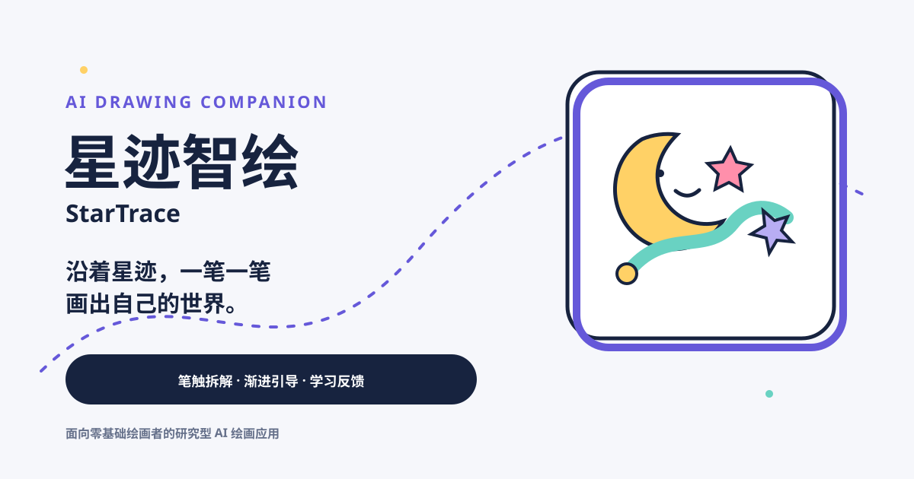

<p align="center"></p>

# 星迹智绘 StarTrace

面向零基础绘画者的研究型 AI 绘画应用。系统把参考图拆成一组有顺序的“绘画星点”和“星迹笔触”，由“月亮伙伴”逐笔提示，帮助用户更容易开始第一笔、完成一次练习并形成持续动笔习惯。

> 沿着星迹，一笔一笔画出自己的世界。

## 核心体验

- 绘画星点：每一步可执行的起笔提示。
- 星迹笔触：笔触拆解算法输出的有序路径。
- 月亮伙伴：解释下一笔与当前进度的 AI 绘画向导。
- 星愿：轻量、具体的每日绘画任务。
- 星图：本地作品与练习记录。
- 学习反馈：区分亲手完成、AI 辅助与内容覆盖，不把完成率当作能力评分。

五步流程：选择参考 → AI 拆解 → 跟随星迹 → 完成绘画 → 查看学习反馈。

## 研究目标

项目用于探究“AI 笔触拆解技术产品化”为绘画应用后，对零基础绘画者绘画入门和动笔频次的影响。重点指标包括首次动笔时延、实际动笔率、亲手完成笔触、AI 辅助比例、单次完成情况和一段时间内的练习频次。

当前产品数据只能描述交互行为，不能直接证明绘画能力或因果效果。正式论文研究需配合知情同意、对照条件、统一任务、前后测与迁移任务，详见 [RESEARCH_PROTOCOL.md](./RESEARCH_PROTOCOL.md)。

## 隐私原则

- 匿名研究数据与作品云保存默认关闭，且分别授权。
- 不要求姓名、学校、手机号等身份信息。
- 默认研究记录不包含原图、作品图片、笔触坐标和颜色。
- 用户可在“设置与隐私”中撤回同意并删除本地与对应云端数据。
- 主动使用 AI 星光变换前，会说明当前画布需要临时发送给图像生成服务。
- 研究后台需要服务端访问口令，口令只在当前浏览器标签页暂存。

## 本地运行

```bash
npm install
npm run dev -- -p 3001
```

访问 `http://localhost:3001`。

质量检查：

```bash
npm run lint
npx tsc --noEmit
npm run build
```

## 环境变量

所有密钥只放在本地或部署平台环境变量中，不写入代码、日志或 Git。

| 变量 | 用途 |
|---|---|
| `HUNYUAN_API_KEY` / `DASHSCOPE_API_KEY` | 服务端图像生成与可选文字反馈适配器，至少配置一种 |
| `OSS_BUCKET` / `OSS_REGION` | 可选的研究记录与作品云存储 |
| `OSS_ACCESS_KEY_ID` / `OSS_ACCESS_KEY_SECRET` | 云存储服务端凭据 |
| `ANALYTICS_ADMIN_TOKEN` | 研究后台访问口令，部署研究版时必须配置 |

## 主要路由

| 路由 | 功能 |
|---|---|
| `/` | 世界观主页与入口 |
| `/intro` | 产品、交互、算法和研究属性介绍 |
| `/create` | 精选临摹、上传参考图或自由画布 |
| `/paint` | 星点/星迹引导与自由绘画 |
| `/gallery` | 作品星图与练习概览 |
| `/report` | 可解释的绘画学习反馈 |
| `/settings` | 绘画偏好、研究同意和数据删除 |
| `/admin/analytics` | 受口令保护的匿名研究数据后台 |

## 技术结构

- Next.js App Router、React、TypeScript、Tailwind CSS。
- 客户端笔触拆解与引导判定，完整笔触序列用于分步临摹。
- 服务端图像生成和可选 LLM 学习反馈；界面不展示具体模型或供应商背书。
- 浏览器本地画廊与练习记录；研究与作品云存储仅在用户授权后启用。

部署顺序：完成修改 → lint / typecheck / build → 本地浏览器验收 → 用户确认 → Git 与云部署。未经本地确认不覆盖线上版本。
